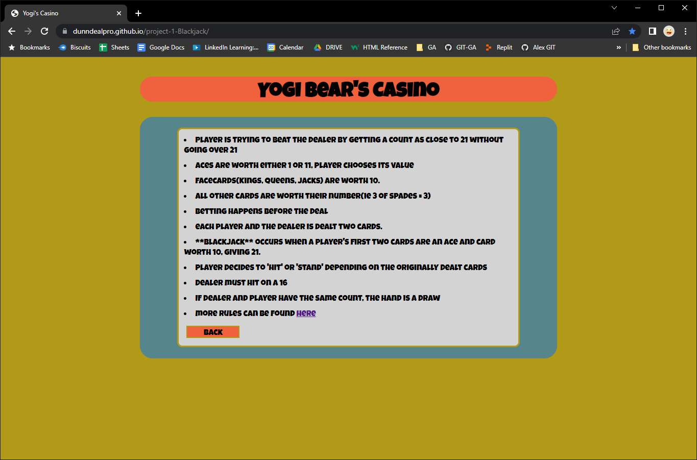
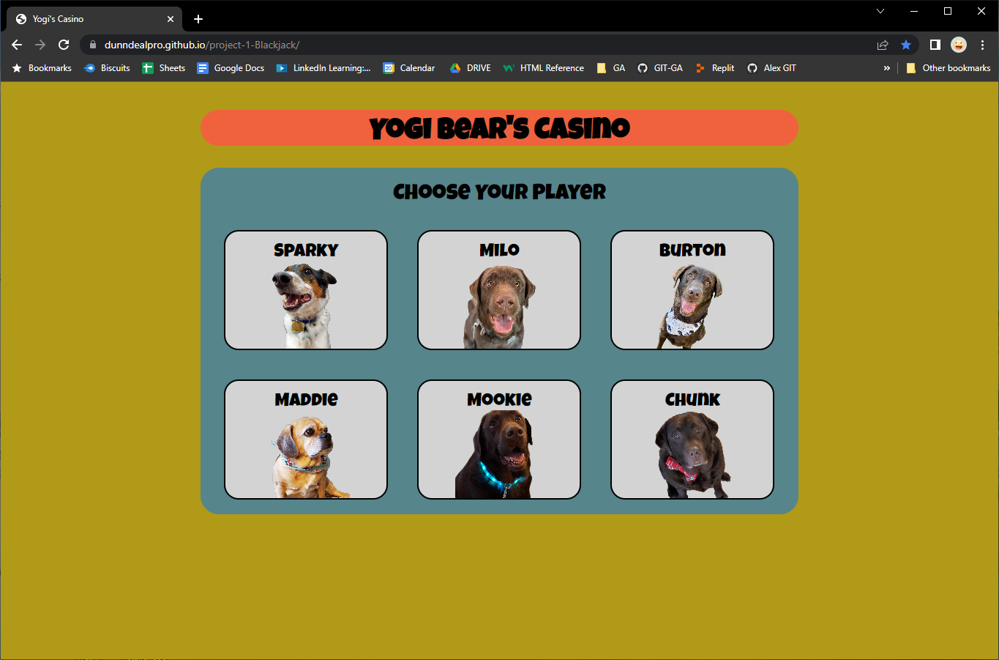
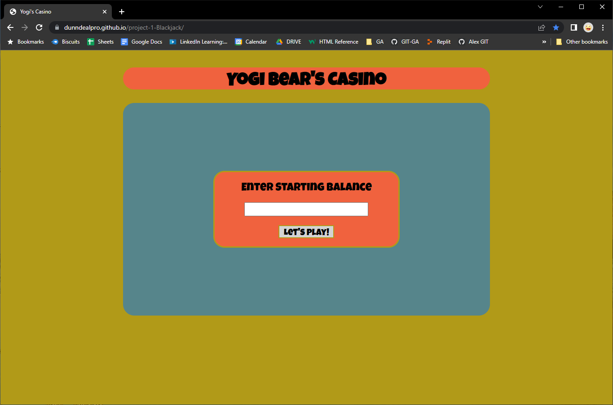
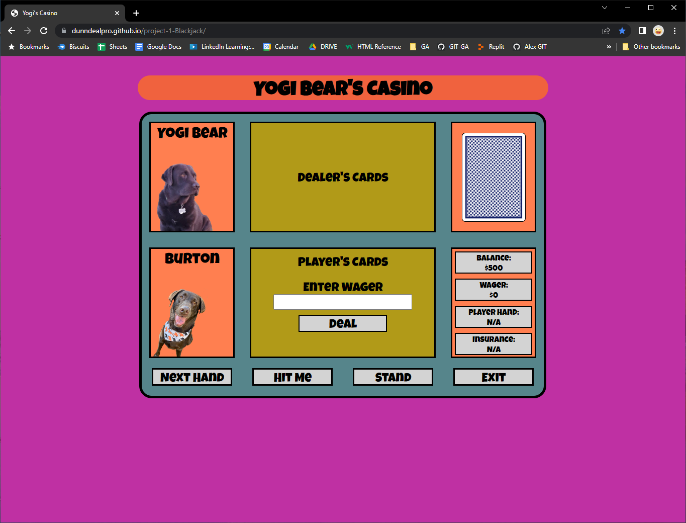
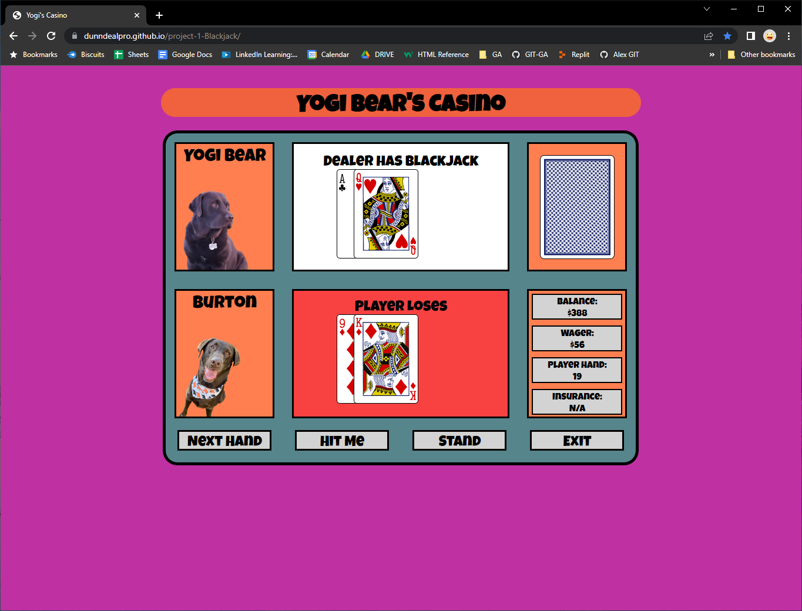
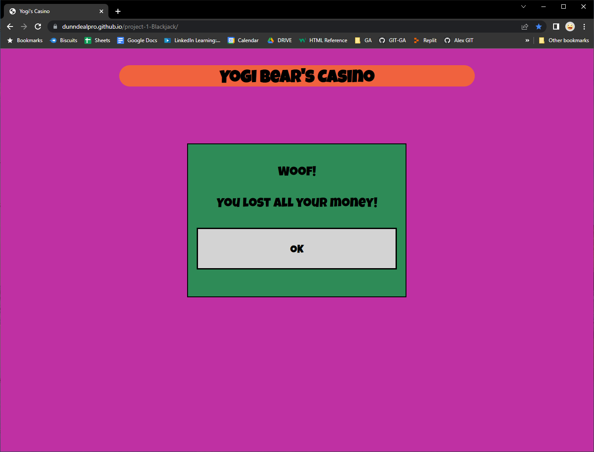

# Black Jack

https://dunndealpro.github.io/project-1-Blackjack/

## Object of the Game
- player is trying to beat the dealer by getting a count as close to 21 without going over 21

## Card Values 
- Aces are worth either 1 or 11, player choses its value
- Facecards(Kings, Queens, Jacks) are worth 10.
- all other cards are worth their number(ie 3 of spades = 3)

## Rules
- Betting happens before the deal

- Each player and the dealer is dealt two cards.  
    - players cards are dealt face up while the dealers second card is dealt faced down

- **Blackjack** occurs when a player's first two cards are an ace and card worth 10, giving 21.  
    -if the dealers face up card is a 10 card or an ace, dealer checks face down card for a **Blackjack**
    -if the dealer does not have **Blackjack** the player automatically wins and player wins one and half times their betted amount
    -if the dealer also has **Blackjack**, it is revealed and this is a tie or a draw, and the player receives his bet back.
    -if not a black jack, dealer's face down card is left face down until it is the dealer's turn
    -dealer plays last

- player decides to 'hit' or 'stand' depending on the originally dealt cards 
    - player may 'hit' for an additional card to get closer to 21, until deciding to 'stand'
    - player 'busts' and loses wager if cards total over 21

- if player has an ace and any other non-10 card, player can count ace as 1 or 11 and may decided to continue to 'hit' or 'stand'
    - if  player has a "soft 17" (an ace and a 6), the total is 7 or 17. While a count of 17 is a good hand, the player may wish to draw for a higher total. If the draw creates a bust hand by counting the ace as an 11, the player counts the ace as a 1 and continues playing by 'standing' or 'hitting' 

- after player has finished their turn, dealers face card is turned up
    - if the total is 17 or more, dealer stands
    - if total is 16 or less, dealer must hit
    - if the dealer has an ace, and counting it as 11 would bring the total to 17 or more (but not over 21), the dealer must count the ace as 11 and stand.

## The following rules will be implemented for future development

- if player's first two are the same amount, they may **split** and split their cards into two separate hands
    - if choose to split, original wager must be placed on first card and equal amount is place on second card
    - the two hands are treated as two separate hands. 
        - with a pair of aces player is only given one card for each ace and must stand
            - if second card is a 10-card, payoff is 1:1(unlike 1:1.5 as with black jack at another time)

- if a players original two cards total 9, 10, or 11, the may **double down**
    - player doubles their wager, and receives only one addition card and play resumes
        - if player has two five's player may either split, double down or play regularly
        - dealer does not have option for splitting or doubling down

- if dealer's face up card is an ace, a player may make a side wager called **insurance** up to half the amount of their original wager

    - if the dealer's facedown card is a 10-card, the side bet or **insurance** is paid out 2:1
    - if the dealer does get **Blackjack** and the player does not have **Blackjack** or **insurance**, the hand is over the player's wager is lost
        - if player has **Blackjack** it is a tie or a draw.  original wager is given back to the player

*rules have been summarized from https://bicyclecards.com/how-to-play/blackjack/

## Screen Shots

https://dunndealpro.github.io/project-1-Blackjack/

## Technologies Used

- HTML5
- CSS 3
- JavaScript ES6
- Adobe PhotoShop 2022
- Microsoft Paint Version 21H2

## Getting Started

- For the best gameplay experience, it is recommended to be played on a maximized browser window.  

- Click "Start" to begin the game or click "Rules" to get the basic rules.
- Choose Player by clicking on picture.
- Enter starting balance(numerical value greater than zero) and either hit 'enter' key or click "Let's Play."
- Enter your wager amount and either hit 'enter' key or click "Deal" to start your hand.  Wager amount will cary over to the next hand, but will have the option to increase or decrease.
- If BlackJack occurs for either dealer or player, the hand will end.  Click "Next Hand" to continue.
- Click "Hit Me" to receive next card or click "Stand" to reveal dealers cards.(Dealer will automatically receive cards)
    - If player "Busts", hand will automatically end.  Click "Next Hand" to continue.
- If player's balance reaches '$0,' the game will automatically end.  

https://dunndealpro.github.io/project-1-Blackjack/

## Next Steps / Future Enhancements

- optimized for mobile devices
- Create Split Hand functions
- Create insurance Option
- Create Double Down functions
- Add setTimeout functions to revealing dealers card to add anticipation
- Add sound effects and animations to cards being dealt
